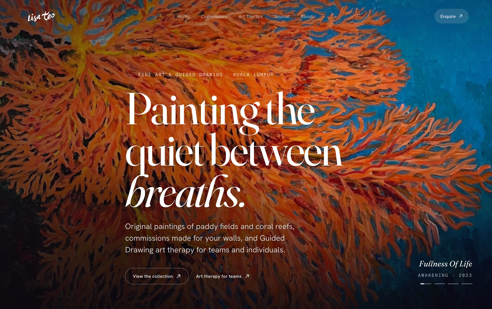
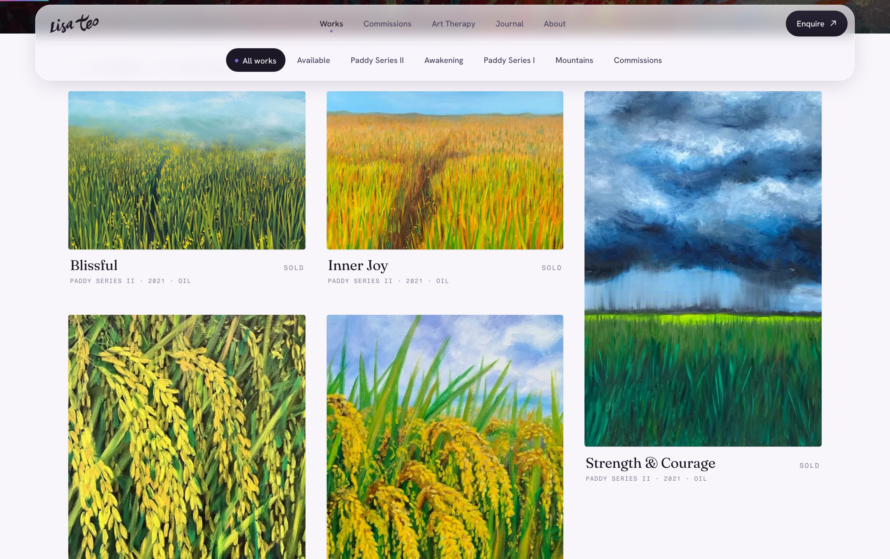
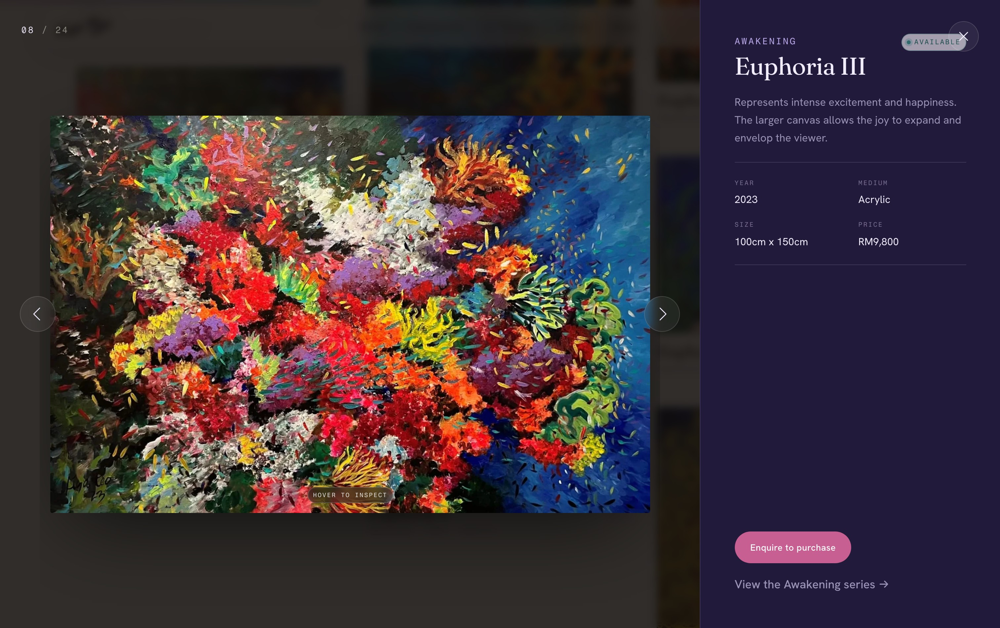
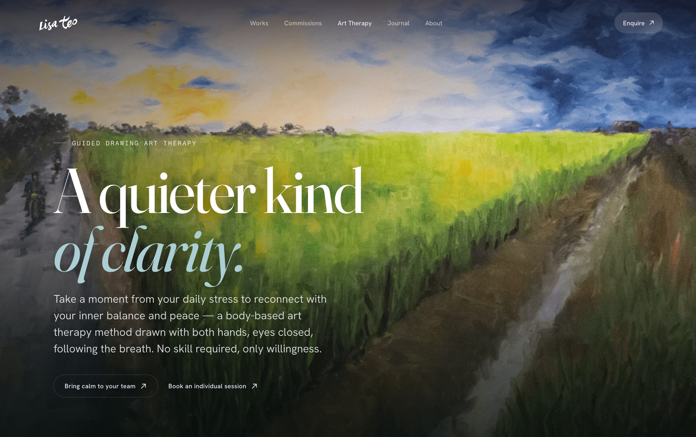
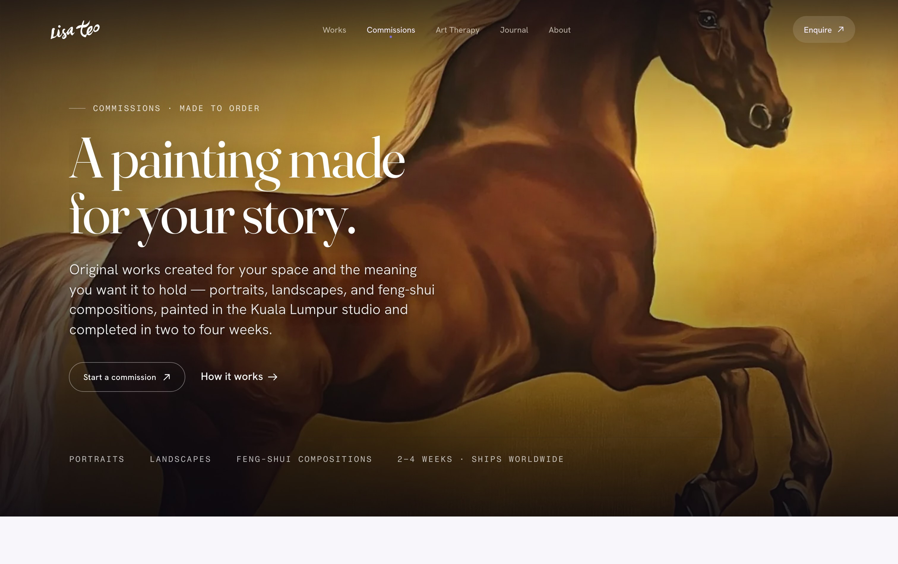
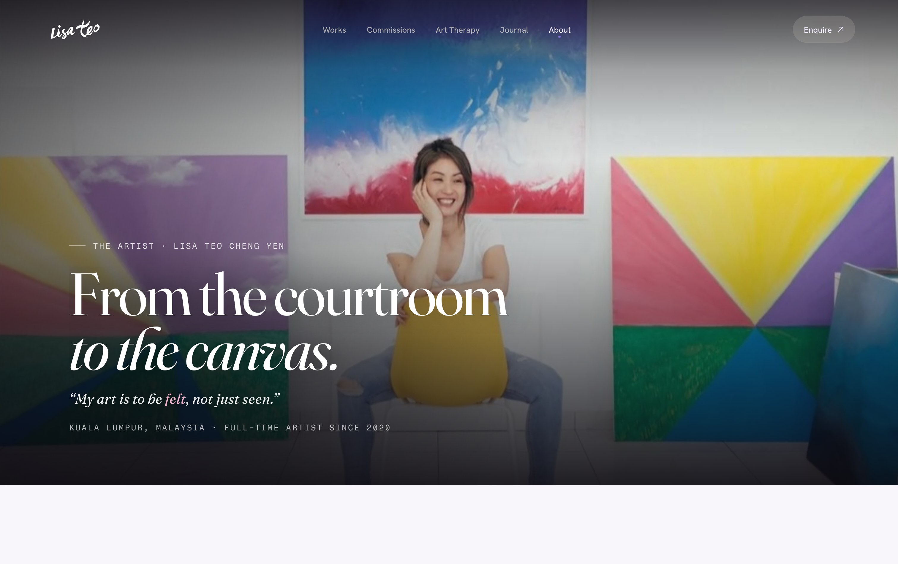
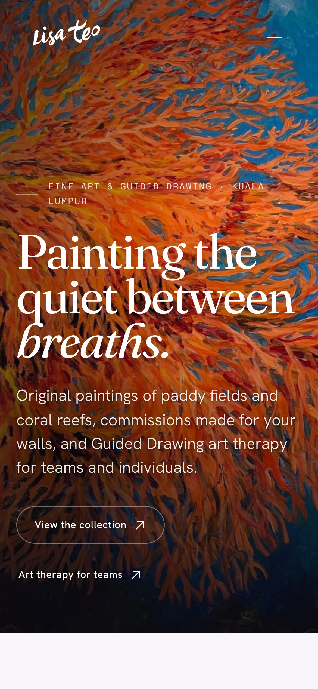

<div align="center">

# Lisa Teo — Artist Studio

**Fine art · Commissions · Guided Drawing art therapy**
An editorial, artwork-led website for Kuala Lumpur painter [Lisa Teo](https://www.lisateoart.com) — built to let the paintings carry the colour.

<br />



<br />


</div>

---

## ✦ Overview

A full custom redesign for an artist with three distinct practices — **original paintings**, **bespoke commissions**, and **Guided Drawing art therapy for corporate teams** — each with its own dedicated page and voice. The design direction is *"watercolour, disciplined"*: calm, airy, editorial layouts where a confident serif and generous space frame the work, and colour arrives in committed single-hue moments rather than decoration. **The artwork carries the palette; the interface stays quiet.**

Every interaction is hand-built — a magnetic cursor, a WebGL shader field, a liquid page-transition, and a shared-element gallery lightbox — tuned to feel physical and expensive without ever reading as "flashy."

## ✦ Highlights

- 🖼️ **Artwork-led galleries** — 66 paintings across five series, presented as a composed gallery wall with a shared-element lightbox, cursor-tracking loupe, and gesture navigation.
- 🎞️ **Film-develop image loading** — a responsive WebP pipeline (5 sizes + LQIP blur-up) so paintings resolve like film rather than popping in. The gallery page dropped **~14 MB → ~6 MB**.
- 🌊 **Signature motion** — custom magnetic cursor, `ogl` WebGL shader hero, Lenis smooth scroll, a liquid-blade route transition, and scroll-reveal typography.
- 📱 **Considered on mobile** — the lightbox becomes a painting-first scroll sheet with a fixed, thumb-reachable navigation bar and wrap-around browsing.
- 🎨 **A real design system** — cool "paper & ink" tokens, an indigo-dusk dark surface family, a single sanctioned brushstroke highlight, and one signature easing curve applied throughout.
- ♿ **Accessible & fast** — full `prefers-reduced-motion` support, visible `:focus-visible` states, lazy-loaded imagery, and semantic markup.

## ✦ Screenshots

|  |  |
|:--:|:--:|
|  |  |
| **The collection** — a balanced gallery-wall grid | **Lightbox** — shared-element expansion + details |
|  |  |
| **Art Therapy** — Guided Drawing for teams | **Commissions** — made-to-order works |
|  |  |
| **About** — from the courtroom to the canvas | **Mobile** — artwork-first, edge to edge |

## ✦ Tech stack

| Area | Choice |
|---|---|
| Framework | **React 19** + **Vite 7** |
| Routing | **react-router-dom v7** |
| Motion | **Framer Motion** (layout / shared-element / scroll reveals) |
| WebGL | **ogl** (fragment-shader hero fields) |
| Smooth scroll | **Lenis** |
| Gestures | **@use-gesture/react** (swipe / drag-to-dismiss) |
| Image pipeline | **sharp** (responsive WebP + LQIP) |
| Type | Fraunces · Hanken Grotesk · Fragment Mono |
| Hosting | **Vercel** |

## ✦ Project structure

```
website/
├── public/
│   └── images/            # artwork, artist photos, brand logos, journal
│       └── derived/       # generated responsive WebP (built by the pipeline)
├── scripts/
│   └── optimize-images.mjs   # sharp → responsive WebP + blur placeholders
├── src/
│   ├── components/        # Nav, Footer, Gallery, Cursor, ShaderField,
│   │                      #   RouteCurtain, Reveal, PageHeroBg, …
│   ├── pages/             # Home, Works, Series, Commissions, ArtTherapy,
│   │                      #   About, Journal, JournalPost, Contact
│   ├── data/              # artworks.js, site.js, cta.js  (all content)
│   ├── hooks/ · lib/      # useReveal, responsive-image helpers
│   ├── styles/            # index.css (tokens) + per-surface CSS
│   └── App.jsx
└── vite.config.js
```

Content lives entirely in `src/data/` — the gallery, series, filters, and routes are generated from `artworks.js`, so adding a series auto-wires its page, filter chip, and grid.

## ✦ Getting started

```bash
# install
npm install

# run the dev server (http://localhost:5173)
npm run dev

# production build + local preview
npm run build
npm run preview

# lint
npm run lint
```

### Image optimization

Responsive WebP derivatives (and their blur placeholders) are generated from the originals in `public/images/`:

```bash
node scripts/optimize-images.mjs          # generate missing sizes
node scripts/optimize-images.mjs --force  # rebuild everything
```

Run it whenever new artwork is added.

## ✦ Signature interactions

| Component | What it does |
|---|---|
| `Cursor` | Magnetic custom cursor that adopts each artwork's colour on hover |
| `ShaderField` | `ogl` fragment-shader background field (dusk / bloom palettes) |
| `RouteCurtain` | Liquid-blade page transition, themed per destination |
| `Gallery` + lightbox | Shared-element `layoutId` expansion, loupe, swipe & keyboard nav, mobile scroll-sheet |
| `Reveal` / `LineReveal` / `Brush` | Scroll-triggered entrances and the hand-painted highlight stroke |

## ✦ Design system

- **Paper & ink** — a cool near-white paper (`#f8f5fb`) and deep ink (`#1c1826`) keep light sections calm.
- **Indigo dusk** — a single committed dark-surface family for feature bands and CTAs.
- **One expressive device** — a painted brushstroke behind a key word, used sparingly. No gradient text, no scattered colour.
- **One easing curve** — `cubic-bezier(0.16, 1, 0.3, 1)` for the premium, physical feel across buttons, reveals, and transitions.

---

<div align="center">

Paintings and content © Lisa Teo. Site design & build crafted with care.

</div>
